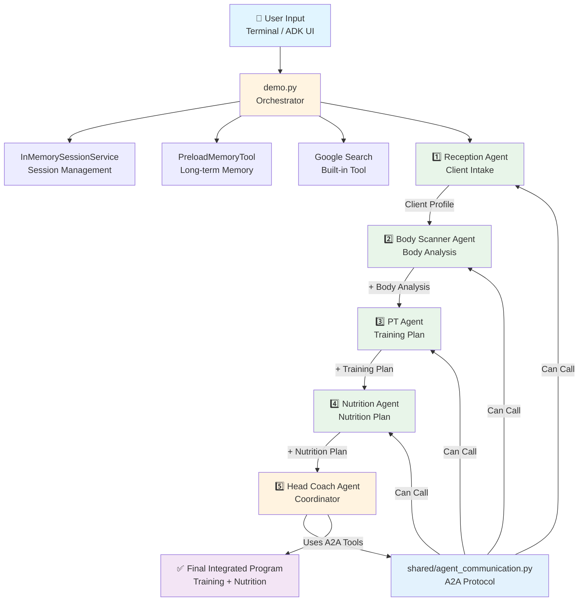
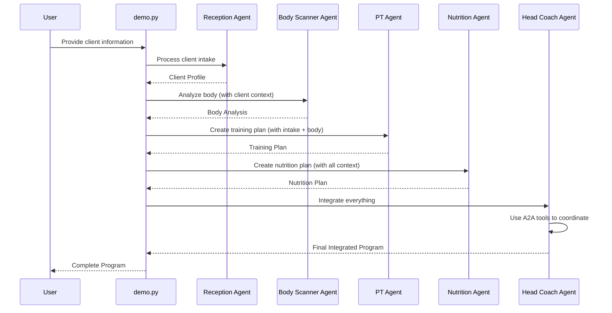
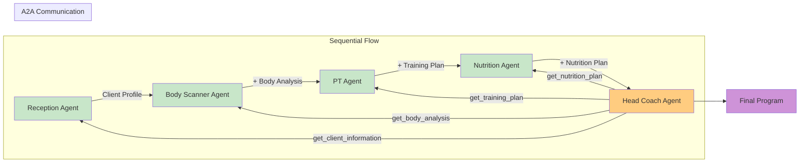
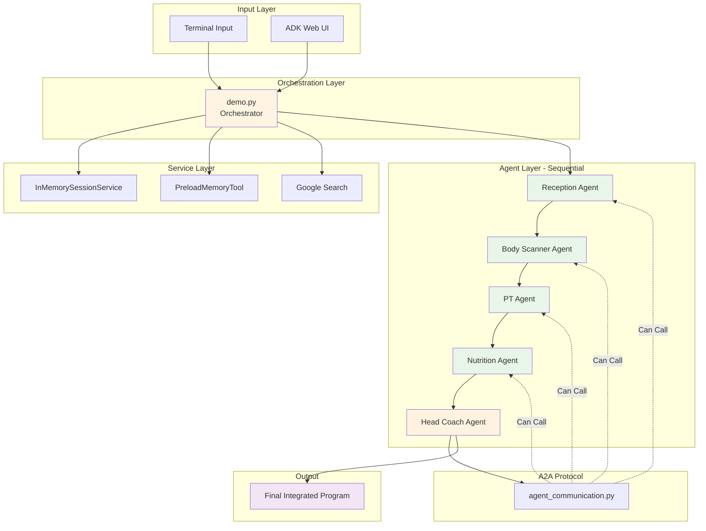

# FitTelligence - Architecture Diagram

## Visual Architecture (Mermaid Diagram)

GitHub will automatically render this Mermaid diagram:



## Sequential Flow Diagram



## Agent Relationship Diagram



## System Architecture



---

## 📸 How to Generate an Image

### Option 1: Use Mermaid Live Editor
1. Go to https://mermaid.live/
2. Copy any of the Mermaid diagrams above
3. Click "Export" → "PNG" or "SVG"
4. Save the image

### Option 2: Use GitHub
- GitHub automatically renders Mermaid diagrams in markdown files
- Just view `ARCHITECTURE_DIAGRAM.md` on GitHub

### Option 3: Use Online Tools
- **Mermaid.ink**: https://mermaid.ink/ (generates images from Mermaid code)
- **Kroki**: https://kroki.io/ (supports Mermaid)

### Option 4: Use Python (diagrams library)
```python
# Install: pip install diagrams
from diagrams import Diagram, Cluster, Edge
from diagrams.onprem.client import User
from diagrams.programming.language import Python
from diagrams.onprem.compute import Server

with Diagram("FitTelligence Architecture", show=False):
    user = User("User")
    demo = Python("demo.py")
    
    with Cluster("Agents"):
        agents = [
            Python("Reception"),
            Python("Body Scanner"),
            Python("PT"),
            Python("Nutrition"),
            Python("Head Coach")
        ]
    
    user >> demo >> agents[0] >> agents[1] >> agents[2] >> agents[3] >> agents[4]
```

---

## 🎨 Visual Summary

The architecture shows:
- **5 Sequential Agents** working in a pipeline
- **Shared Services** (Session, Memory, Tools)
- **A2A Protocol** for agent coordination
- **Information Flow** from user input to final program

