# FitTelligence - Architecture Diagram

## Visual Architecture (Mermaid Diagram)

GitHub will automatically render this Mermaid diagram:

```mermaid
graph TB
    User[👤 User Input<br/>Terminal / ADK UI] --> Demo[demo.py<br/>Orchestrator]
    
    Demo --> Session[InMemorySessionService<br/>Session Management]
    Demo --> Memory[PreloadMemoryTool<br/>Long-term Memory]
    Demo --> Tools[Google Search<br/>Built-in Tool]
    
    Demo --> Agent1[1️⃣ Reception Agent<br/>Client Intake]
    Agent1 -->|Client Profile| Agent2[2️⃣ Body Scanner Agent<br/>Body Analysis]
    Agent2 -->|+ Body Analysis| Agent3[3️⃣ PT Agent<br/>Training Plan]
    Agent3 -->|+ Training Plan| Agent4[4️⃣ Nutrition Agent<br/>Nutrition Plan]
    Agent4 -->|+ Nutrition Plan| Agent5[5️⃣ Head Coach Agent<br/>Coordinator]
    
    Agent5 -->|Uses A2A Tools| A2A[shared/agent_communication.py<br/>A2A Protocol]
    A2A -->|Can Call| Agent1
    A2A -->|Can Call| Agent2
    A2A -->|Can Call| Agent3
    A2A -->|Can Call| Agent4
    
    Agent5 --> Final[✅ Final Integrated Program<br/>Training + Nutrition]
    
    style User fill:#e1f5ff
    style Demo fill:#fff4e1
    style Agent1 fill:#e8f5e9
    style Agent2 fill:#e8f5e9
    style Agent3 fill:#e8f5e9
    style Agent4 fill:#e8f5e9
    style Agent5 fill:#fff3e0
    style Final fill:#f3e5f5
    style A2A fill:#e3f2fd
```

## Sequential Flow Diagram

## Agent Relationship Diagram

## System Architecture

---